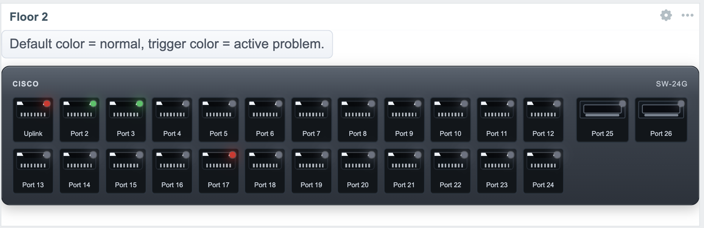

# Switch Widget (Zabbix 7.0)

Uses native Zabbix selection fields.

## Screenshot



## Configure

1. Select global `Host` (selection box style).
2. Set `Rows` and `Ports per row` (total ports = rows x ports per row).
3. Set optional `Brand` and `Model` text for switch bezel.
4. Set widget `Name` to control the dashboard widget title (header text).
5. Optional: set `Legend text` (leave empty to hide).
6. Optional: set traffic patterns (`Traffic in item pattern`, `Traffic out item pattern`) using `*` as port placeholder (example: `ifInOctets[*]`).
7. Optional: select `Profile` to auto-fill layout (`Rows`, `Ports per row`, `SFP ports`, `Size (%)`, `Brand`, `Model`).
8. Optional: rename profile directly next to `Profile`.
9. Optional: use `Save current to selected profile` to overwrite selected profile (1-7).
10. Set optional `Size (%)` (40-100) to make switch compact.
11. Set optional `SFP ports` (0 = none, 2 = two extra SFP ports).
12. Select per-port `Trigger` from dropdown (for selected host).
13. Set per-port `Default color`, `Trigger OK color` and `Trigger NOK color`.
14. Optional: use `Bulk actions` to apply one color to all ports for each state.

Note: Trigger options are rendered server-side from selected host.
If you change host, reopen widget edit to refresh trigger lists.

## UI

- Widget renders with switch-style port front panel.
- Widget header title uses the widget `Name` field.
- Port status uses LED-like color indicator:
  - default color (light gray) = no trigger configured
  - trigger OK color = trigger configured and OK
  - trigger NOK color = active problem
- Port hover tooltip includes:
  - state/type/trigger text
  - IN/OUT sparkline + latest value (when user has item read permission)

## Release Notes 1.0.7

- Security hardening: widget now validates host access server-side.
- If selected host is not accessible for current user, widget shows access denied message instead of rendering port data.
- Trigger state handling tightened to avoid false OK colors when trigger metadata is not accessible.

## Profile Storage Permissions

Profiles are stored in `profiles.json` inside the module directory.  
The web/PHP user must be able to write this file when using `Save current to selected profile`.

Example (RHEL/Alma/Rocky with `apache`):

```bash
sudo chown root:apache /usr/share/zabbix/modules/switch/profiles.json
sudo chmod 664 /usr/share/zabbix/modules/switch/profiles.json
sudo chmod 755 /usr/share/zabbix/modules/switch
```

If SELinux is enabled, also set writable context:

```bash
sudo semanage fcontext -a -t httpd_sys_rw_content_t "/usr/share/zabbix/modules/switch/profiles.json"
sudo restorecon -v /usr/share/zabbix/modules/switch/profiles.json
```
